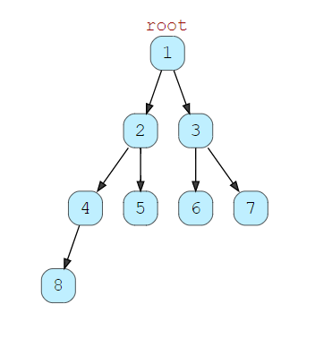
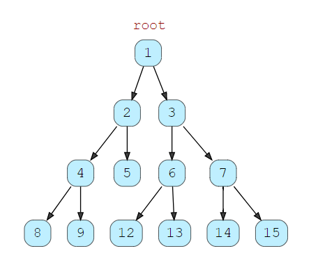

# Binary Tree Data Structure

A **_binary tree_** is a data structure in which each node at most two
children, which are referred to as the left child and the right child.
```
       Parend Node (root node)
             /    \
            /      \
           /        \
       left child   right child
```
<hr>

### Depth of Node

The length of the path from a node to the root node. Keeping this in mind,
the length of the parent/root node is always `0`.
```
            root node
               2
             /    \
            /      \
           /        \
          7          5  -----------> Depth = 1
       /    \          /   \
     /        \       /     \
    6          9     2       6   -----------Depth = 2
```
In the above tree, the depth of the nodes with data `7` and `5` is `1`

<hr>

### Height Of a Tree
The length of the path from n to its deepest descendant. The height of the 
tree itself is the height of the root node, and the height of leaf nodes is 
always `0`.
```
    Height of a Tree = Height of a Root Node
```

<hr>

### Types of Binary Tree
There are following main types of Binary Trees

#### Complete Binary Tree
In a complete binary tree, every level except possibly the last, is completely filled and all nodes in the last level 
are as far left as possible.



### Full Binary Tree

A full binary tree (sometimes referred to as a proper or plane binary tree) is a tree in which every node has either 
`0` or `2` children.

