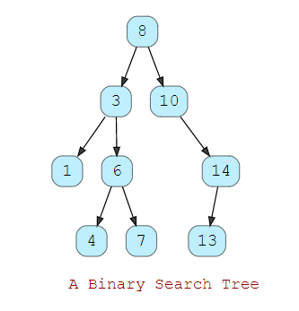

# Binary Search Tree (BST)

**_A binary Search Tree is a tree data structure in which nodes are arranged according to
BST properties which are given below 👇_**

- The value of the left child of any node in binary tree is less than the value of that node and
the value of the right child of that node is greater than the value in that node. One such example 
  is given below 👇
  
```
                               2  ------------> Node
                             /    \
                            /      \
                           /        \
value is less than `2`<-- 1          5  -----------> Node node is greater than `2` which is parent
```


